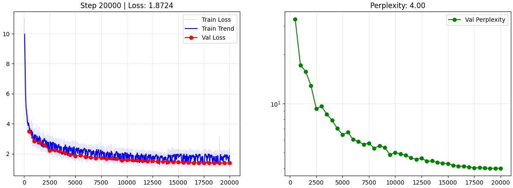

#  GemmaZero: High-Fidelity Gemma 2/3 Replication

**GemmaZero** is a modular, high-performance replication of Google’s **Gemma 2 and 3** architectures. Scaled to **~90 Million parameters** and optimized for the **TinyStories** dataset, this project implements the specific mathematical stabilizers and structural innovations that allow Gemma models to achieve state-of-the-art performance.

---

## Key Features & Architectural Gemma "Tricks"

Unlike standard Transformers, **GemmaZero** incorporates the specific techniques from google's paper to ensure training stability and superior reasoning:

*   **RMSNorm with Unit Offset (+1.0):** Implements the unique Gemma normalization where weights are initialized at 0.0 and offset by 1.0. This ensures a stable "passthrough" state at the start of training.
*   **QK-Norm (Query-Key Normalization):** Queries and Keys are normalized via RMSNorm before the dot-product. This prevents **Exploding Gradients** and allows for significantly higher learning rates.
*   **Logit Soft-Capping:** Prevents model overconfidence and training spikes by **tanh-capping** the final output logits (scaled to 30.0), keeping the loss curve smooth.
*   **GeGLU Activations:** Replaces standard ReLU/GELU with **Gated Linear Units (GeGLU)** for more expressive feed-forward layers.
*   **Large Head Dimension (128):** Follows the Gemma 2/3 spec of using larger **128-dim heads** rather than the standard 64-dim, allowing each head to capture more complex semantic relationships.
*   **Grouped Query Attention (GQA):** Uses 6 Query heads and 2 KV heads (ensuring perfect division for PyTorch broadcasting) to heavily reduce the VRAM footprint of the KV Cache during inference.
*   **Embedding Scaling:** Input embeddings are scaled by **sqrt(d_model)** to preserve signal strength across deep layers.

---

##  Training Techniques & Optimizations

The training pipeline is designed for **maximum efficiency** on consumer-grade GPUs (e.g., NVIDIA T4, RTX 30/40 series):

*   **8-bit AdamW Optimization:** Powered by **bitsandbytes**, reducing optimizer VRAM usage by **75%** with no loss in accuracy.
*   **Mixed Precision (AMP):** Full **FP16 training** with GradScaler, providing a **3x speedup** on modern hardware.
*   **Gradient Checkpointing:** Saves massive amounts of VRAM by re-computing activations during the backward pass, enabling larger models on smaller hardware.
*   **Cosine Decay Scheduler:** Implements the Google-standard learning rate schedule with a **linear warmup** followed by a **cosine cooldown** for optimal weight convergence.
*   **Gradient Accumulation:** Decouples physical batch size from mathematical batch size, enabling stable training with an effective batch size of **32+** on low-VRAM cards.

---

##  Resume & Cloud Logic

GemmaZero is built to be **Crash-Proof** for long training runs:

*   **Full State Checkpointing:** Saves not just weights, but also the **Optimizer, Scheduler, and Scaler** states.
*   **Hugging Face Two-Track Save:** 
    *   `pytorch_model.bin`: Light weights for sharing and inference.
    *   `latest_full_checkpoint.pth`: Heavy "Save Game" file containing the optimizer state for perfect resuming.
*   **Seamless Auto-Resume:** Upon startup, the script automatically checks for local or remote (**Hugging Face**) checkpoints. If found, it downloads them and continues training from the **exact step** it left off.

---

##  Model Specifications

| Parameter | Value |
| :--- | :--- |
| **Total Parameters** | ~90.5 Million |
| **Hidden Size** | 768 |
| **Intermediate Size** | 3072 |
| **Layers** | 6 |
| **Attention Heads** | 6 (Query), 4 (KV) |
| **Head Dimension** | 128 |
| **Vocabulary Size** | 50,257 (GPT-2) |
| **Context Length** | 1024 Tokens |

---

##  Project Structure

*   `config.py`: Centralized hyperparameters and architecture settings.
*   `modules.py`: Low-level Gemma math (**RMSNorm, RoPE, apply-logic**).
*   `model.py`: High-level Transformer blocks and the full **GemmaZeroModel**.
*   `train.py`: High-performance training loop with streaming data and cloud sync.
*   `inference.py`: Story generation script with **Top-K sampling** and temperature control.

---

##  Training Results
After a 20,000 step training run on the TinyStories dataset, GemmaZero successfully converged, demonstrating exceptional generalization with zero signs of overfitting:

*   Final Training Loss: 1.87
*   Final Validation Loss: 1.83
*   Final Validation Perplexity: 4.00

A Perplexity of 4.00 indicates the model narrows down its next-word prediction to just 4 highly likely choices out of a 50,000+ token vocabulary, resulting in highly coherent, grammatically perfect English generation.

  

