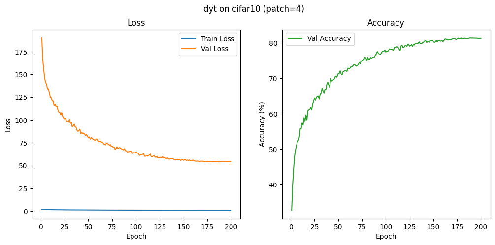

# DyT CIFAR-10 Notebook

## Research Papers
- **Vision Transformer (ViT)** — Dosovitskiy et al., "An Image is Worth 16x16 Words: Transformers for Image Recognition at Scale" (ICLR 2021). ViT introduced patch embeddings plus transformer encoders for vision, which DyT inherits.
- **Dynamic Tanh Transformer (DyT)** — Zhu et al., "Transformers without Normalization" (2025). DyT swaps LayerNorm for learnable Dynamic Tanh blocks, improving stability on small datasets like CIFAR-10.

## Techniques and Features
- Runs entirely inside `dyt_cifar10.ipynb`, keeping the training recipe self-contained for notebook-friendly work.
- CIFAR-10 preprocessing includes RandAugment (N=2, M=14), random crop/flip, and normalization, followed by mixup (α=0.2) before batching.
- DyT (`dyt.py`) is built with patch embeddings, Dynamic Tanh in place of normalization, and a cosine-scheduled AdamW optimizer with AMP scaling to stay within an 8–10 GB VRAM budget.
- Automatic resume: checkpoints are written to `checkpoint/dyt_cifar10_latest.pth` (plus best copy) and logs/CSVs land in `log/` so a notebook restart can pick up mid-run.
- Matplotlib plotting saves `plots/dyt_cifar10_training.png` for quick loss/accuracy inspection, and `plots/.gitkeep` keeps the folder in the repo.

## Tips and Tricks
1. Run the notebook in Jupyter or Colab so you can rerun individual cells; the checkpoint system makes it safe to interrupt the kernel.
2. Adjust a single config cell (batch size, dim, depth, learning rate) instead of spreading flags across multiple scripts.
3. Keep the large folders (`Vit-Dyt/data`, `checkpoint`, `log`, `wandb`) out of Git—they are ignored, so they can grow locally without affecting pushes.
4. After training, re-open `plots/dyt_cifar10_training.png` to verify the learning curves before sharing results.
